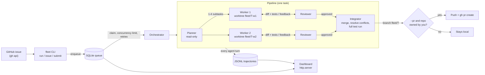

# agent-fleet

A fleet of autonomous coding agents, Devin-style. Give it a task or a GitHub issue; it
clones the repo, reads the code, plans, splits the work across parallel agents in separate
git worktrees, edits, runs tests, gets every change reviewed, merges the results, runs the
full suite, and (on repos you own) opens a PR.

- **Claude Opus 5.5** (`claude-opus-5-5`) via the `anthropic` SDK with tool use, adaptive
  thinking, streaming and prompt caching
- **Roles**: planner, parallel workers, reviewer, integrator
- **Sandboxed**: every command runs in a network-less Docker container (or a jailed
  subprocess when Docker is missing), in a per-agent git worktree
- **Queue + orchestrator**: SQLite task queue, concurrency limit, retries, status CLI and a
  live web dashboard (stdlib `http.server`)
- **Every step logged** as JSONL trajectories
- **Offline scripted backend** that replays deterministic tool calls, so the whole pipeline
  runs and is tested without an API key

## Architecture



Each agent is the same loop with a different role (system prompt, tool allowlist, `finish`
schema):

```mermaid
sequenceDiagram
    participant A as Agent loop
    participant M as Model (Claude / scripted)
    participant T as Toolbox (worktree jail)
    participant S as Sandbox (docker / subprocess)
    loop until finish or budget spent
        A->>M: system + append-only history + tools
        M-->>A: thinking + text + tool_use blocks
        A->>A: validate each input against its schema
        A->>T: read_file / grep / apply_patch / git_diff ...
        T->>S: run_command / run_tests
        S-->>T: output, exit code (denylist, timeout, no network)
        T-->>A: results, all in one user message
        A->>A: log to JSONL; compact when the context grows
    end
```

| Module | What it does |
|---|---|
| `sandbox.py` | Denylist check, then Docker (`--network none`, only the worktree mounted, memory/CPU/pid limits) or a subprocess jailed to the worktree (secrets scrubbed from env, process-group timeout, capped output) |
| `tools.py` | `read_file`, `list_dir`, `grep`, `write_file`, `apply_patch` (exact unique search/replace), `run_command`, `run_tests`, `git_diff`; paths that escape the worktree (incl. symlinks) or touch `.git` are refused |
| `agent.py` | Tool-use loop, turn + token budgets, task-wide token meter, schema validation of tool inputs, compaction |
| `models.py` | `ClaudeModel` (Opus 5.5) and `ScriptedModel` (offline replay) |
| `roles.py` | Planner / worker / reviewer / integrator prompts, tool allowlists and `finish` schemas |
| `pipeline.py` | plan -> parallel reviewed workers -> integrate, all in git worktrees |
| `queue.py`, `orchestrator.py` | SQLite queue with atomic claims and retries; concurrent task runner |
| `github.py` | Issue import, ownership guard, push + PR |
| `dashboard.py` | Live task list and per-agent trajectory panels |

## Quickstart

```sh
pip install -e '.[dev]'

# offline demo: no API key, fixes the two seeded bugs in examples/sample-repo
examples/demo.sh

# real run with Claude on a local repo (never pushes)
export ANTHROPIC_API_KEY=...
fleet run ~/code/myproject "Make the date parser accept ISO week dates" --test-cmd "python -m pytest -q"

# work on a GitHub issue; --pr pushes and opens a PR, only if you own the repo
fleet issue you/yourrepo#12 --pr

fleet status            # all tasks
fleet status <id>       # one task: subtasks, review verdicts, diffstat, tokens, PR
fleet logs <id> -f      # stream every agent's trajectory
fleet serve             # dashboard on http://127.0.0.1:8765
```

Queue now, run later: `fleet submit <repo> "<task>"` then `fleet worker --concurrency 3`
(add `--forever` to keep polling). `fleet cancel <id>` / `fleet retry <id>` manage tasks.

Useful options: `--max-workers` (parallel workers per task), `--review-rounds`,
`--max-turns` (per agent), `--task-tokens` (shared by all agents of a task),
`--effort` (`high` by default; Opus 5.5 would otherwise default to `medium`),
`--sandbox auto|docker|subprocess`, `--image` (Docker image with your project's test deps),
`--max-attempts` (retries on crashes). State lives in `~/.fleet` (override with `--home` or
`FLEET_HOME`).

## Safety model

- **Local by default.** Nothing is pushed unless you pass `--pr`.
- **Owned repos only.** Before any push the authenticated `gh` login must equal the repo
  owner, the API must report that owner with admin permission, and the clone's `origin` must
  be exactly `https://github.com/<owner>/<repo>`. Anything else raises `NotOwnedError`;
  `fleet issue <someone-else's repo> --pr` is refused before a single token is spent.
  Branches are pushed without `--force`.
- **Isolated workspaces.** Agents only ever touch their own worktree on a `fleet/*` branch;
  your checkout is never modified. Merged worker branches are deleted afterwards; rejected
  ones are kept for inspection.
- **Sandboxed commands.** With Docker (auto-detected) every command runs in a throwaway
  container with no network, only the worktree mounted, non-root uid, memory/CPU/pid
  limits. The default image (`agent-fleet-sandbox:py3.12`, slim + pytest) is built locally
  on first use. Without Docker, commands run as a subprocess with `cwd` in the worktree,
  secret-looking env vars (`*KEY*`, `*TOKEN*`, ...) removed, and a hard timeout that kills
  the whole process group. The denylist (pushes, remote edits, `gh`, `sudo`, deletes
  outside the workspace, pipe-to-shell, disk/system commands) applies in both modes; in
  subprocess mode it is a speed bump, not a security boundary - use Docker for untrusted
  code.
- **Least privilege per role.** Planner and reviewer cannot edit files; nobody can reach
  `.git` through the file tools.

## Claude integration

`ClaudeModel` calls `client.messages.stream(...)` with `model="claude-opus-5-5"`,
`thinking={"type": "adaptive"}`, `output_config={"effort": "high"}`, top-level
`cache_control` for the growing conversation prefix, and `eager_input_streaming` on every
tool (inputs are validated against the schema before running, and calls cut off by
`max_tokens` are never executed). `tool_choice` is left at `auto` - forced tool choice is
rejected by Opus 5.5.

Opus 5.5 ties thinking blocks to the conversation, so the history is **append-only**:
response content, thinking blocks included, is replayed verbatim. When a request's input
passes `compact_at` (150k tokens by default) the agent does *simple compaction*: the model
writes working notes and the agent continues in a fresh context that starts from those
notes, without replaying any earlier thinking. `refusal` stop reasons end the agent cleanly;
400/401/403/404 API errors fail the task without burning retries, while 429/5xx are retried.

## Scripted backend

A script maps agent names (or role names) to turns; each turn is a list of tool calls or
text blocks:

```json
{
  "planner":  [[{"name": "finish", "input": {"summary": "...", "subtasks": [{"title": "Fix add", "description": "..."}]}}]],
  "worker-1": [[{"text": "root cause is in add()"},
                {"name": "apply_patch", "input": {"path": "calc.py", "old": "a - b", "new": "a + b"}}],
               [{"name": "run_tests", "input": {}}]],
  "reviewer": [[{"name": "finish", "input": {"verdict": "approve", "feedback": "lgtm"}}]]
}
```

Lookup is exact name first (`worker-1`, `worker-1.r2` for a revision, `integrator-1`), then
the role. An exhausted script calls `finish` with schema-valid defaults (a reviewer then
requests changes, never approves). See `examples/scripts/`.

## Trajectories

`~/.fleet/runs/<task>/<agent>.jsonl`, one JSON object per line:

```json
{"ts": 1790325106.9, "agent": "worker-1", "event": "start", "model": "claude-opus-5-5", "sandbox": "docker", "tools": ["read_file", "..."], "task": "..."}
{"ts": 1790325107.2, "agent": "worker-1", "event": "model", "turn": 2, "stop_reason": "tool_use", "usage": {"input_tokens": 1843, "output_tokens": 61}, "content": [...]}
{"ts": 1790325107.4, "agent": "worker-1", "event": "tool", "name": "apply_patch", "input": {...}, "is_error": false, "output": "patched shop/pricing.py"}
{"ts": 1790325108.0, "agent": "worker-1", "event": "end", "status": "finished", "turns": 4, "tokens": 3179, "output": {...}}
```

## Verification

`pytest -q` runs 90 tests (unit tests plus end-to-end pipeline runs with the scripted
backend; the Docker sandbox test is opt-in via `FLEET_DOCKER_TESTS=1`); CI runs them on Python 3.10-3.13, plus the Docker sandbox test and the offline
demo.

Observed output of `examples/demo.sh` (scripted backend, Docker sandbox):

```
== before: tests
FAILED (failures=4)
task 9ec522dc queued; running...
task 9ec522dc: done (finished), attempts 1/2
branch: fleet/9ec522dc  tests: PASS
  - [approve] Fix apply_discount (1 round(s))
  - [approve] Fix slugify (1 round(s))
 shop/pricing.py | 2 +-
 shop/text.py    | 2 +-
 2 files changed, 2 insertions(+), 2 deletions(-)
== fleet/9ec522dc
*   539e1f3 Merge fleet/9ec522dc-w2: Fix slugify
|\
| * 924d317 Fix slugify
* 4718dec Merge fleet/9ec522dc-w1: Fix apply_discount
* 6f7a2d1 Fix apply_discount
```

Issue to PR on the sandbox repo
([agent-fleet-sandbox](https://github.com/sakshamchitkara-dotcom/agent-fleet-sandbox),
seeded bug + [issue #1](https://github.com/sakshamchitkara-dotcom/agent-fleet-sandbox/issues/1)):

```
$ fleet issue sakshamchitkara-dotcom/agent-fleet-sandbox#1 --pr --backend scripted \
    --script examples/scripts/sandbox-issue.json --test-cmd "python -m unittest -v"
issue: Discounts are inverted: apply_discount returns the discount instead of the discounted price (https://github.com/sakshamchitkara-dotcom/agent-fleet-sandbox/issues/1)
task 7f480773: done (finished), attempts 1/2
repo: sakshamchitkara-dotcom/agent-fleet-sandbox
branch: fleet/7f480773  tests: PASS
  - [approve] Fix inverted discount in apply_discount (1 round(s))
 shop/pricing.py | 2 +-
 1 file changed, 1 insertion(+), 1 deletion(-)
PR: https://github.com/sakshamchitkara-dotcom/agent-fleet-sandbox/pull/3

$ fleet issue torvalds/linux#1 --pr
refused: torvalds/linux is not owned by the authenticated user 'sakshamchitkara-dotcom'; refusing to push or open a PR
```

## Limitations

- The scripted backend proves the plumbing, not the model's judgment.
- Subprocess mode cannot block network access; prefer Docker.
- Only Python test commands are exercised in CI, though any `--test-cmd` works.
- The planner is asked for non-overlapping subtasks; when they do collide the integrator
  resolves the conflict or the branch is skipped (never force-merged).

## License

MIT
