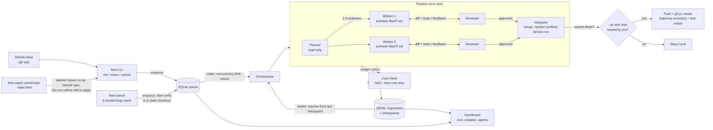
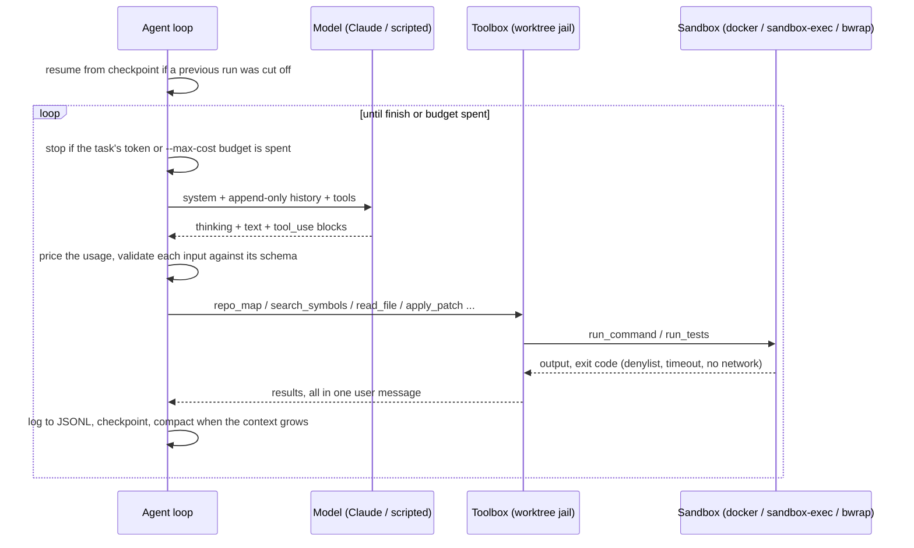

# agent-fleet

A fleet of autonomous coding agents, Devin-style. Give it a task or a GitHub issue; it
clones the repo, reads the code, plans, splits the work across parallel agents in separate
git worktrees, edits, runs tests, gets every change reviewed, merges the results, runs the
full suite, and (on repos you own) opens a PR.

- **Claude Opus 5.5** (`claude-opus-5-5`) via the `anthropic` SDK with tool use, adaptive
  thinking, streaming and prompt caching
- **Roles**: planner, parallel workers, reviewer, integrator
- **Sandboxed**: every command runs in a network-less Docker container, or without Docker
  in an OS jail (`sandbox-exec` on macOS, bubblewrap / `unshare` on Linux) that blocks the
  network and confines writes to the agent's git worktree; the isolation level in force is
  shown in `fleet status` and the dashboard
- **Codebase index**: `repo_map` (file tree + top-level symbols, Python via `ast`, other
  languages via regex) and `search_symbols`, so agents orient in one or two calls
- **Cost tracking**: per-agent tokens and estimated USD from the model's published prices,
  live in status and dashboard, with a hard `--max-cost` stop
- **Resumable**: every agent checkpoints its conversation after each turn; tasks survive an
  orchestrator crash or restart and continue where they stopped
- **Queue + orchestrator**: SQLite task queue, concurrency limit, retries, status CLI and a
  live web dashboard (stdlib `http.server`)
- **Every step logged** as JSONL trajectories
- **Offline scripted backend** that replays deterministic tool calls, so the whole pipeline
  runs and is tested without an API key
- **Benchmark**: `fleet bench` runs five seeded-bug toy repos and reports pass rate, turns,
  tokens and cost (scripted in CI, Claude when a key is present)
- **GitHub**: `fleet issue owner/repo#N --pr`, and `fleet watch owner/repo --label fleet`
  to pick up labeled issues (dry-run by default); PRs carry a trajectory summary and the
  test output

## Architecture



Each agent is the same loop with a different role (system prompt, tool allowlist, `finish`
schema):



| Module | What it does |
|---|---|
| `sandbox.py` | Denylist check, then Docker (`--network none`, only the worktree mounted, memory/CPU/pid limits) or a subprocess in the strongest OS jail available (`sandbox-exec` / `bwrap` / `unshare`), secrets scrubbed from env, process-group timeout, capped output |
| `tools.py` | `repo_map`, `search_symbols`, `read_file`, `list_dir`, `grep`, `write_file`, `apply_patch` (exact unique search/replace), `run_command`, `run_tests`, `git_diff`; paths that escape the worktree (incl. symlinks) or touch `.git` are refused |
| `index.py` | Repo map and symbol search: Python via `ast`, JS/TS, Go, Rust, Ruby, Java, Kotlin, C, shell via regex |
| `agent.py` | Tool-use loop, turn + token budgets, task-wide token/USD meter, schema validation of tool inputs, checkpoints and resume, compaction |
| `pricing.py` | Per-model $/MTok table and per-request cost (fresh input, cache writes, cache reads, output) |
| `models.py` | `ClaudeModel` (Opus 5.5) and `ScriptedModel` (offline replay) |
| `roles.py` | Planner / worker / reviewer / integrator prompts, tool allowlists and `finish` schemas |
| `pipeline.py` | plan -> parallel reviewed workers -> integrate, all in git worktrees |
| `queue.py`, `orchestrator.py` | SQLite queue with atomic claims and retries; concurrent task runner |
| `github.py` | Issue import, labeled-issue polling, ownership guard, push + PR with trajectory summary |
| `bench/` | Five seeded-bug repos with scripted solutions and the scoring harness behind `fleet bench` |
| `dashboard.py` | Live task list and per-agent trajectory panels |

## Quickstart

```sh
pip install -e '.[dev]'

# offline demo: no API key, fixes the two seeded bugs in examples/sample-repo
examples/demo.sh

# real run with Claude on a local repo (never pushes)
export ANTHROPIC_API_KEY=...
fleet run ~/code/myproject "Make the date parser accept ISO week dates" --test-cmd "python -m pytest -q"

# work on a GitHub issue; --pr pushes and opens a PR, only if you own the repo
fleet issue you/yourrepo#12 --pr

# pick up issues labeled "fleet" on a repo you own: prints what it would do...
fleet watch you/yourrepo --label fleet --once
# ...and only runs them (and opens PRs) when asked
fleet watch you/yourrepo --label fleet --apply --pr --max-cost 5

fleet bench             # 5 seeded-bug repos: pass rate, turns, tokens, cost
fleet status            # all tasks, with estimated cost
fleet status <id>       # one task: sandbox isolation, subtasks, verdicts, diffstat, tokens, cost, PR
fleet logs <id> -f      # stream every agent's trajectory
fleet serve             # dashboard on http://127.0.0.1:8765
```

Queue now, run later: `fleet submit <repo> "<task>"` then `fleet worker --concurrency 3`
(add `--forever` to keep polling). `fleet cancel <id>` / `fleet retry <id>` manage tasks.

Useful options: `--max-workers` (parallel workers per task), `--review-rounds`,
`--max-turns` (per agent), `--task-tokens` (shared by all agents of a task),
`--max-cost USD` (hard stop on the task's estimated API cost),
`--effort` (`high` by default; Opus 5.5 would otherwise default to `medium`),
`--sandbox auto|docker|subprocess`, `--image` (Docker image with your project's test deps),
`--max-attempts` (retries on crashes). State lives in `~/.fleet` (override with `--home` or
`FLEET_HOME`).

## Safety model

- **Local by default.** Nothing is pushed unless you pass `--pr`.
- **Owned repos only.** Before any push the authenticated `gh` login must equal the repo
  owner, the API must report that owner with admin permission, and the clone's `origin` must
  be exactly `https://github.com/<owner>/<repo>`. Anything else raises `NotOwnedError`;
  `fleet issue <someone-else's repo> --pr` is refused before a single token is spent.
  Branches are pushed without `--force`.
- **Isolated workspaces.** Agents only ever touch their own worktree on a `fleet/*` branch;
  your checkout is never modified. Merged worker branches are deleted afterwards; rejected
  ones are kept for inspection.
- **Sandboxed commands.** With Docker (auto-detected) every command runs in a throwaway
  container with no network, only the worktree mounted, non-root uid, memory/CPU/pid
  limits. The default image (`agent-fleet-sandbox:py3.12`, slim + pytest) is built locally
  on first use. Without Docker, commands run as a subprocess with `cwd` in the worktree,
  secret-looking env vars (`*KEY*`, `*TOKEN*`, ...) removed, a hard timeout that kills the
  whole process group, and the strongest jail that starts on the host (each is probed once):

  | Jail | Network | Writes | Where |
  |---|---|---|---|
  | `docker` | none | only the mounted worktree | Docker available |
  | `sandbox-exec` | denied (unix sockets allowed) | worktree + private `TMPDIR` | macOS |
  | `bwrap` | own empty net namespace | worktree + private `TMPDIR`, read-only root | Linux with bubblewrap and user namespaces |
  | `unshare` | own empty net namespace | **not confined** | Linux, no bubblewrap |
  | `none` | **not confined** | **not confined** | anything else |

  The level in force is logged in every agent's start event and shown by `fleet status <id>`
  and the dashboard (in red when something is not confined). The denylist (pushes, remote
  edits, `gh`, `sudo`, deletes outside the workspace, pipe-to-shell, disk/system commands)
  applies in every mode; it is a speed bump, not a security boundary.
- **Budgets.** Turn and token limits per agent, a token budget per task, and `--max-cost`:
  once the task's estimated spend reaches it, no agent takes another turn.
- **Least privilege per role.** Planner and reviewer cannot edit files; nobody can reach
  `.git` through the file tools.

## Claude integration

`ClaudeModel` calls `client.messages.stream(...)` with `model="claude-opus-5-5"`,
`thinking={"type": "adaptive"}`, `output_config={"effort": "high"}`, top-level
`cache_control` for the growing conversation prefix, and `eager_input_streaming` on every
tool (inputs are validated against the schema before running, and calls cut off by
`max_tokens` are never executed). `tool_choice` is left at `auto` - forced tool choice is
rejected by Opus 5.5.

Opus 5.5 ties thinking blocks to the conversation, so the history is **append-only**:
response content, thinking blocks included, is replayed verbatim. When a request's input
passes `compact_at` (150k tokens by default) the agent does *simple compaction*: the model
writes working notes and the agent continues in a fresh context that starts from those
notes, without replaying any earlier thinking. `refusal` stop reasons end the agent cleanly;
400/401/403/404 API errors fail the task without burning retries, while 429/5xx are retried.

## Scripted backend

A script maps agent names (or role names) to turns; each turn is a list of tool calls or
text blocks:

```json
{
  "planner":  [[{"name": "finish", "input": {"summary": "...", "subtasks": [{"title": "Fix add", "description": "..."}]}}]],
  "worker-1": [[{"text": "root cause is in add()"},
                {"name": "apply_patch", "input": {"path": "calc.py", "old": "a - b", "new": "a + b"}}],
               [{"name": "run_tests", "input": {}}]],
  "reviewer": [[{"name": "finish", "input": {"verdict": "approve", "feedback": "lgtm"}}]]
}
```

Lookup is exact name first (`worker-1`, `worker-1.r2` for a revision, `integrator-1`), then
the role. An exhausted script calls `finish` with schema-valid defaults (a reviewer then
requests changes, never approves). See `examples/scripts/`.

## Trajectories

`~/.fleet/runs/<task>/<agent>.jsonl`, one JSON object per line:

```json
{"ts": 1790325106.9, "agent": "worker-1", "event": "start", "model": "claude-opus-5-5", "sandbox": "subprocess", "isolation": "sandbox-exec: no network, writes confined to the worktree", "tools": ["repo_map", "..."], "task": "..."}
{"ts": 1790325107.2, "agent": "worker-1", "event": "model", "turn": 2, "stop_reason": "tool_use", "usage": {"input_tokens": 1843, "output_tokens": 61, "cache_read_input_tokens": 1500, "cache_creation_input_tokens": 300}, "cost": 0.00316, "content": [...]}
{"ts": 1790325107.4, "agent": "worker-1", "event": "tool", "name": "apply_patch", "input": {...}, "is_error": false, "output": "patched shop/pricing.py"}
{"ts": 1790325111.0, "agent": "worker-1", "event": "resume", "turn": 2, "tokens": 2210, "cost": 0.0121}
{"ts": 1790325112.0, "agent": "worker-1", "event": "end", "status": "finished", "turns": 4, "tokens": 3179, "cost": 0.0163, "output": {...}}
```

Next to each trajectory, `<agent>.ckpt.json` holds the agent's full conversation (thinking
signatures included) as of its last completed turn; it is deleted when the agent ends.

## Cost and budgets

Each model call is priced from its usage with the rates in `pricing.py`, taken from the
Claude API model table (Anthropic first-party rates, USD per million tokens):

| Model | Input | Output | Cache read |
|---|---:|---:|---:|
| `claude-opus-5-5` (default) | 4.00 | 20.00 | 0.20 |
| `claude-opus-5`, `claude-opus-4-8` / `4-7` / `4-6` | 5.00 | 25.00 | 0.50 |
| `claude-fable-5-1` | 10.00 | 50.00 | 0.25 |
| `claude-sonnet-5` | 2.00 | 10.00 | 0.20 |
| `claude-haiku-4-5` | 1.00 | 5.00 | 0.10 |

Cache writes are billed at 1.25x input (the 5-minute TTL the Claude backend requests).
Costs are shown per agent and per task in `fleet status`, `fleet logs`, the dashboard and the
PR footer. `--max-cost USD` is a hard stop checked before every model call, so a task
overshoots by at most one turn per running agent; the task then fails with
`task budget exhausted: <tokens>, $<spent> of $<limit>`. With the scripted backend the
"tokens" are a character-count estimate, so its costs are simulated.

## Resuming after a restart

Agents checkpoint after every turn. If the orchestrator dies (crash, `kill -9`, reboot),
the next `fleet worker` requeues the interrupted task without charging an attempt and the
pipeline picks up where it stopped: same base commit, surviving worktrees and branches
reused (uncommitted edits included), agents that had already ended are replayed from their
trajectory instead of re-run, and interrupted agents continue their conversation
append-only from the last checkpoint. Integration restarts from base, since merges are
cheap and deterministic. A turn that was in flight when the process died is generated
again. `fleet retry <id>` is different: it moves the old run to `runs/<id>/attempt-<ts>/`
and starts over.

## Benchmark

`fleet bench` seeds five toy repos with known bugs, runs the fleet on each, and verifies
the result itself: the branch must pass the suite in a clean checkout outside the sandbox,
and the tests must be untouched.

| Case | Bug |
|---|---|
| `paginate` | off-by-one slice end drops the last item of every page |
| `median` | even-length median returns the upper middle value |
| `inventory` | mutable default argument leaks state between calls |
| `duration` | wrong unit constant (a minute is 6 seconds) |
| `bank` | two independent bugs in two modules (overdraft allowed, percent used as a fraction) |

It uses Claude when `ANTHROPIC_API_KEY` or `ANTHROPIC_AUTH_TOKEN` is set and the scripted
solutions otherwise (`--backend` overrides); `--min-pass 1` makes it a CI gate, `--json`
writes the results, `--max-cost` caps each case.

## Verification

`pytest -q` runs 114 tests (unit tests plus end-to-end pipeline, resume and bench runs with
the scripted backend; the Docker sandbox test is opt-in via `FLEET_DOCKER_TESTS=1`). CI runs
them on Python 3.10-3.13 with bubblewrap installed (and fails if the Linux jail is not
`bwrap`), plus the Docker sandbox test, the offline demo and `fleet bench --backend scripted
--min-pass 1`.

`fleet bench --backend scripted` (macOS, `sandbox-exec` jail):

```
bench: 5 case(s), scripted backend, state in /var/folders/.../fleet-bench-v39zya3g
CASE         RESULT TURNS   TOKENS      COST  NOTE
bank         PASS      13    4,411   $0.0267
duration     PASS       7    1,737   $0.0109
inventory    PASS       7    1,920   $0.0132
median       PASS       7    1,815   $0.0119
paginate     PASS       7    1,841   $0.0116
pass rate 5/5 (100%), turns 41, tokens 11,724, cost $0.0743 [scripted backend; tokens and cost are simulated]
```

Resume after `kill -9` of the orchestrator while `worker-1` was mid-task (scripted backend
with a slow command added to its script), then a plain `fleet worker`:

```
== after kill -9
ID        STATUS     STAGE                     TRY     AGE      COST  TASK
4d457633  running    working (2 subtasks)        1      4s   $0.0363  Fix the failing tests
== restart
task 4d457633: done (finished), attempts 1/2
sandbox: sandbox-exec: no network, writes confined to the worktree
branch: fleet/4d457633  tests: PASS
  - [approve] Fix apply_discount (1 round(s))
  - [approve] Fix slugify (1 round(s))
cost: $0.0511 est. (planner $0.0155, reviewer-1 $0.0052, reviewer-2 $0.0069, worker-1 $0.0159, worker-2 $0.0076)
== worker-1 log
02:30:16 worker-1       ~ turn 2 (tool_use) apply_discount returns the discount, not the discounted price. ...
02:30:16 worker-1       > apply_patch {"path": "shop/pricing.py", ...}
02:30:16 worker-1       ~ turn 3 (tool_use)
02:30:20 worker-1       + resumed from checkpoint after turn 2
02:30:20 worker-1       ~ turn 3 (tool_use)
02:30:28 worker-1       > run_command {"command": "sleep 8"}
...
02:30:28 worker-1       = finished after 5 turns, 2386 tokens, $0.0135
```

Labeled issue to PR on the sandbox repo
([agent-fleet-sandbox](https://github.com/sakshamchitkara-dotcom/agent-fleet-sandbox),
seeded bug + [issue #1](https://github.com/sakshamchitkara-dotcom/agent-fleet-sandbox/issues/1)
labeled `fleet`), resulting in
[PR #4](https://github.com/sakshamchitkara-dotcom/agent-fleet-sandbox/pull/4) with the
trajectory table and test output in its description:

```
$ fleet watch sakshamchitkara-dotcom/agent-fleet-sandbox --label fleet --once
watching sakshamchitkara-dotcom/agent-fleet-sandbox for open issues labeled 'fleet' (dry-run)
would work on #1: Discounts are inverted: apply_discount returns the discount instead of the discounted price  (pass --apply to run it)

$ fleet watch sakshamchitkara-dotcom/agent-fleet-sandbox --label fleet --once --apply --pr \
    --backend scripted --script examples/scripts/sandbox-issue.json \
    --test-cmd "python -m unittest -v" --sandbox subprocess --max-cost 1
watching sakshamchitkara-dotcom/agent-fleet-sandbox for open issues labeled 'fleet' (apply + PR)
#1: Discounts are inverted: apply_discount returns the discount instead of the discounted price -> task d4961dd9
task d4961dd9: done (finished), attempts 1/2
repo: sakshamchitkara-dotcom/agent-fleet-sandbox
sandbox: sandbox-exec: no network, writes confined to the worktree
branch: fleet/d4961dd9  tests: PASS
  - [approve] Fix inverted discount in apply_discount (1 round(s))
 shop/pricing.py | 2 +-
 1 file changed, 1 insertion(+), 1 deletion(-)
tokens: 7,658 (planner 2,955, reviewer-1 1,524, worker-1 3,179)
cost: $0.0396 est. of $1.00 budget (planner $0.0157, reviewer-1 $0.0076, worker-1 $0.0163)
PR: https://github.com/sakshamchitkara-dotcom/agent-fleet-sandbox/pull/4

$ fleet watch torvalds/linux --once
refused: torvalds/linux is not owned by the authenticated user 'sakshamchitkara-dotcom'; refusing to push or open a PR
```

The offline demo (`examples/demo.sh`) and the earlier issue-to-PR run
([PR #3](https://github.com/sakshamchitkara-dotcom/agent-fleet-sandbox/pull/3)) still work
the same way; see `CHANGELOG.md` for what changed since.

## Limitations

- The scripted backend proves the plumbing, not the model's judgment; its token and cost
  numbers are simulated. `fleet bench` against Claude has not been run in CI (no key there).
- Without Docker, isolation depends on the host: `sandbox-exec` and `bwrap` block network
  and confine writes, `unshare` only blocks network, and `none` confines nothing (Ubuntu
  24.04 blocks the user namespaces bwrap needs unless
  `kernel.apparmor_restrict_unprivileged_userns=0`). `fleet status` tells you which you got.
- Cost is an estimate from list prices; Bedrock/Vertex pricing, batch discounts and the
  compaction summary call are not included.
- The symbol index is regex-based outside Python and re-parses on every call.
- Only Python test commands are exercised in CI, though any `--test-cmd` works.
- The planner is asked for non-overlapping subtasks; when they do collide the integrator
  resolves the conflict or the branch is skipped (never force-merged).

## License

MIT
